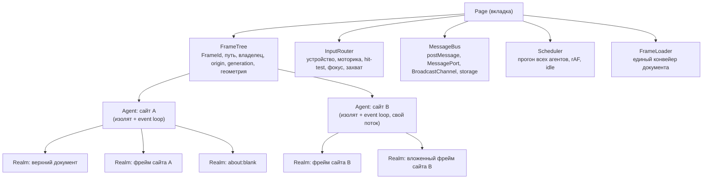
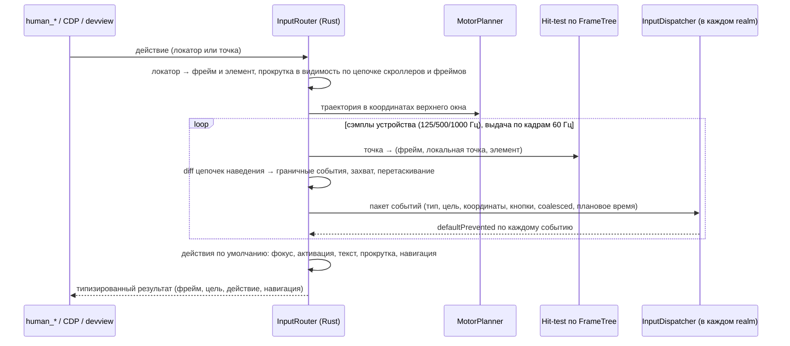
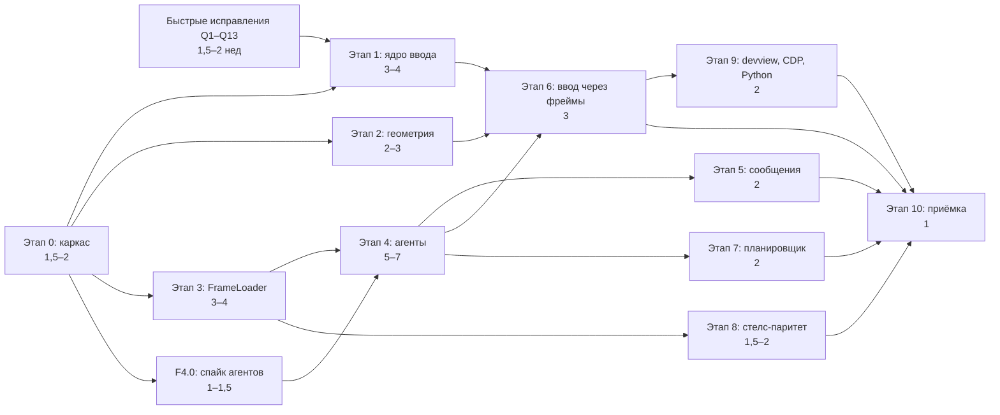

# План: взаимодействие со страницей, humanize и произвольное дерево фреймов

> **Статус:** предложение. **Основание:** ревью механизма взаимодействия. Каждая находка
> воспроизводится пробой `p01…p29` в `crates/browser_oxide/tests/interaction_review_probes.rs`,
> падение при удалении фрейма — тестом `crates/browser_oxide/tests/frame_churn_repro.rs`.
>
> ```
> cargo test -p browser_oxide --test interaction_review_probes -- --ignored --test-threads=1 --nocapture
> ```

## Содержание

1. [Цель и принципы](#1-цель-и-принципы)
2. [Что значит «ведёт себя идентично»](#2-что-значит-ведёт-себя-идентично)
3. [Исходное состояние: что мешает](#3-исходное-состояние-что-мешает)
4. [Целевая архитектура](#4-целевая-архитектура)
5. [Этапы работ](#5-этапы-работ)
6. [Быстрые исправления в текущей архитектуре](#6-быстрые-исправления-в-текущей-архитектуре)
7. [Тестирование: матрица топологий](#7-тестирование-матрица-топологий)
8. [Бюджеты и лимиты](#8-бюджеты-и-лимиты)
9. [Риски и решения, которые надо принять](#9-риски-и-решения-которые-надо-принять)
10. [Трассировка находок ревью](#10-трассировка-находок-ревью)
11. [Порядок и оценки](#11-порядок-и-оценки)
12. [Definition of Done](#12-definition-of-done)

---

## 1. Цель и принципы

**Цель.** Любое действие — движение, наведение, клик, ввод, прокрутка, фокус, перетаскивание —
над любым элементом в любом документе страницы даёт ровно ту же последовательность наблюдаемых
эффектов, что и в Chrome того профиля, от имени которого работает движок. Это верно для верхнего
документа и для фрейма любой глубины, одного или разных origin. Фреймов может быть сколько угодно
(до лимита самого Chrome). Они появляются, исчезают и перенавигируются в любом порядке, в том
числе посреди жеста.

**Главный принцип: у верхнего документа нет особого случая.** Документ во фрейме создаётся тем же
конвейером, получает тот же runtime и обслуживается тем же вводом, что и верхний. Всё, чем фрейм
отличается от верхнего документа, перечислено в таблице допустимых различий (§2.2). Это ровно те
различия, которые есть в самом Chrome.

| # | Принцип |
|---|---|
| P1 | **Один конвейер для любого документа** (`FrameLoader`). Отдельного урезанного загрузчика для фреймов рядом с конвейером верхнего документа не будет |
| P2 | **Страница — это дерево фреймов** (`FrameTree`) произвольной ширины и глубины. У фреймов стабильные `FrameId`, адресация — путём или локатором |
| P3 | **Время жизни фрейма не зависит от порядка создания.** Удаление, вставка и перенавигация допустимы в любой последовательности |
| P4 | **Ввод идёт от «устройства» уровня страницы** (`InputRouter`): единая позиция курсора, кнопки, модификаторы, фокус и захват. Событие попадает в документ через hit-test по дереву фреймов |
| P5 | **Доступ между документами — как в Chrome.** Same-origin документы синхронно видят друг друга, cross-origin — только через разрешённую поверхность WindowProxy и `postMessage` |
| P6 | **Единое время.** Все фреймы продвигаются одновременно, и ни один не «замерзает», пока работает другой |
| P7 | **Механизм невидим странице в любом realm.** Нет глобальных или символьных ручек, нет вызовов через API, которые страница может подменить, нет кадров движка в стеке |
| P8 | **Каждое свойство проверяется одним и тем же тестом во всех позициях дерева** и сравнивается с эталоном Chrome |

**Границы плана.** В плане: `<iframe>`, `<frame>`/`<frameset>`, HTML в `<object>`/`<embed>` и фреймы
внутри shadow DOM, а также весь ввод, фокус, навигация, сообщения, жизненный цикл, геометрия и
стелс-поверхности этих документов. Вне плана (отдельные работы): новые окна верхнего уровня
(`window.open`, `target=_blank`), печать, встроенный просмотр PDF, `<fencedframe>`.

---

## 2. Что значит «ведёт себя идентично»

### 2.1 Инварианты — обязательны для любого документа в любой позиции дерева

| ID | Инвариант | Как проверяем |
|---|---|---|
| I1 | Документ любого фрейма создаётся тем же конвейером, что и верхний, и получает тот же runtime: bootstrap, стелс, диспетчер ввода | Канонический дамп поверхностей realm (прототипы, дескрипторы, значения профиля) совпадает в верхнем документе и во фрейме глубины 1–4, кроме пунктов §2.2 |
| I2 | Жизненный цикл: `readyState` loading → interactive → complete, `DOMContentLoaded`, `load`, `pageshow`. Элемент-владелец `<iframe>` в родителе получает `load`, а `load` родителя ждёт дочерние фреймы (кроме lazy) | Трасса жизненного цикла совпадает с эталоном Chrome для `src`, `srcdoc`, `about:blank`, `data:`, `blob:` |
| I3 | Для одного и того же элемента трасса событий ввода (типы, порядок, поля, `isTrusted`) одинакова в верхнем документе и во фрейме любой глубины — с точностью до пересчёта координат и `timeOrigin` | Сравнение нормализованных трасс действий |
| I4 | Каждое событие ввода движка имеет `isTrusted=true`, не проходит через API, которые страница может подменить, и не оставляет кадров движка в стеке | Хуки страницы на `dispatchEvent`, конструкторы событий, `elementFromPoint`, `setTimeout` видят 0 вызовов; `new Error().stack` в обработчике содержит только кадры страницы |
| I5 | При пересечении границы элемента или фрейма в старой цепочке приходят `pointerout/leave` и `mouseout/leave`, в новой — `over/enter`. Пары сбалансированы; `move` никогда не приходит в элемент без предшествующего `over` | Автомат-валидатор трассы (§7) |
| I6 | В дереве ровно один сфокусированный документ. `document.hasFocus()` истинно только у него и его предков, `activeElement` у предков — владеющий `<iframe>`. При смене фрейма окна получают `blur`/`focus` | Пробы фокуса по матрице |
| I7 | Клавиатура идёт в `activeElement` сфокусированного документа, текст меняется по правилам редактирования | Трассы клавиатуры |
| I8 | Действия по умолчанию одинаковы в любом фрейме: активация, навигация ссылкой (с учётом `target`), отправка формы, прокрутка колесом с передачей предкам | Пробы активации по матрице |
| I9 | `postMessage` доставляется задачей, событие имеет `isTrusted=true`. Работают structured clone и передача `MessagePort`/`ArrayBuffer`, `origin` и `source` правильные (`event.source === iframe.contentWindow`). Работают все направления и любая глубина: `parent`, `top`, `frames[i]`, сосед через `parent.frames[j]`, `opener` | Матрица сообщений |
| I10 | Same-origin фреймы синхронно доступны друг другу (`contentDocument`, `parent.document`, `frameElement`). Между cross-origin доступна только поверхность WindowProxy из спецификации HTML, остальное — `SecurityError` | Пробы доступа |
| I11 | Один документ — один realm: код документа не исполняется дважды, документ и его скрипты не запрашиваются дважды | Счётчики тестового сервера и счётчики исполнения |
| I12 | Фреймы создаются, удаляются, переставляются и перенавигируются в любом порядке без падений и утечек | Фазз-тест 10 000 операций: память и число потоков выходят на плато |
| I13 | Все фреймы продвигаются одновременно: таймеры, rAF, сеть. Во время жеста ни один фрейм не стоит; частота rAF и троттлинг — как в Chrome | Трасса таймеров соседних фреймов во время жеста |
| I14 | `getBoundingClientRect`, `elementFromPoint` и hit-test ввода согласованы и учитывают прокрутку и обрезку в каждом документе. `screenX/screenY` для всех фреймов считаются из одной глобальной позиции курсора | Инвариант «центр видимой части попадает в элемент»; непрерывность `screenX/Y` при переходе через границу фрейма |
| I15 | Лимиты Chrome: не больше 1000 фреймов на страницу (`kMaxNumberOfFrames` в Blink), защита от рекурсии URL предка, `loading=lazy` | Стресс-тест и пробы |
| I16 | Сиды шума canvas/audio/WebGL одинаковы во всех realm сессии, маскировка `toString` работает во всех realm, ни в одном realm нет ручки к внутренностям движка | Сравнение хешей canvas/audio между фреймами; дамп символов и свойств |
| I17 | Любой метод человеческого ввода принимает локатор в любом фрейме и возвращает типизированный результат | Тесты API |
| I18 | Навигация, вызванная действием, выполняется или явно возвращается вызывающему. Навигация фрейма не блокирует цикл страницы, флаг навигации не «залипает» | Пробы навигаций |
| I19 | devview, CDP и Rust/Python API используют один и тот же `InputRouter`: одинаковые команды дают одинаковые события | Сравнение трасс по трём входам |

### 2.2 Допустимые различия — ровно те, что есть в Chrome

| ID | Что отличается во фрейме | Правило |
|---|---|---|
| D1 | `window.top`, `parent`, `frameElement` (у cross-origin — `null`), `length`, `name`, `opener`, `location.ancestorOrigins` | Как в спецификации HTML и в Chrome |
| D2 | Размеры окна | `innerWidth/innerHeight`, `visualViewport` и медиазапросы по ширине берутся от окна фрейма. `outerWidth/outerHeight`, `screenX/screenY`, `screen` и `devicePixelRatio` — как у верхнего окна |
| D3 | `isSecureContext` | Истинно, только если безопасен сам документ и все его предки |
| D4 | Хранилища и куки | `localStorage`, IndexedDB и Cache разделены по top-level site (Storage Partitioning, Chrome 115+). Куки cross-site фреймов подчиняются правилам SameSite/Partitioned той версии Chrome, что указана в профиле |
| D5 | Возможности | Permissions Policy (атрибут `allow` и заголовки), флаги `sandbox` |
| D6 | Сеть | `Sec-Fetch-Dest: iframe`, `Sec-Fetch-Site` относительно родителя, `Referer` по referrer-policy, X-Frame-Options и `frame-ancestors` |
| D7 | Троттлинг | rAF и рендеринг во внеэкранных и скрытых cross-origin фреймах — как в Chrome (сверяется эталоном) |
| D8 | Фокус | `hasFocus()` и `activeElement` по цепочке фокуса (I6) |
| D9 | User activation | Активирует сам фрейм, всех его предков и same-origin потомков (шаги «activation notification» в HTML) |
| D10 | Время | У каждого документа свой `performance.timeOrigin`; `Date.now()` общий |
| D11 | Изоляция | `crossOriginIsolated`, COOP/COEP — у каждого документа свои |
| D12 | Доступ между origin | Всё, кроме разрешённой поверхности WindowProxy/Location, бросает `SecurityError` |

**Всё, что не перечислено в D1–D12, обязано совпадать с верхним документом.**

---

## 3. Исходное состояние: что мешает

Измерения и подробности — в ревью и в пробах. Ниже блокеры, без устранения которых
«сколько угодно фреймов, и везде одинаково» недостижимо.

| ID | Блокер | Где | Доказательство |
|---|---|---|---|
| B1 | Каждый фрейм — отдельный V8-изолят в потоке страницы, а rusty_v8 требует уничтожать изоляты строго в обратном порядке создания. Если удалить фрейм, созданный раньше живого соседа, и пересканировать DOM, процесс падает | `iframe.rs` (`ChildIframe`), `page.rs::rematerialize_iframes` (`children.retain`), `ChildIframe::materialize_descendants` | `tests/frame_churn_repro.rs`: `Fatal error in v8::HandleScope::CreateHandle()` |
| B2 | У одного фрейма два параллельных представления: «родительский» realm для `contentWindow` (`op_create_child_realm`, синхронный `op_net_fetch_sync`, повторное исполнение srcdoc) и настоящий `ChildIframe`. Код исполняется дважды, документ запрашивается дважды, сообщения уходят не в тот realm, а фрейм с относительным `src` считается cross-origin | `dom_bootstrap.js` (≈4400–5300), `dom_ext.rs:1613` | p12, p13 |
| B3 | Два разных конвейера загрузки: верхний (`build_page_with_scripts_init_and_storage`) и урезанный фреймовый (`ChildIframe::from_url`/`from_srcdoc`). У srcdoc нет жизненного цикла, относительные скрипты пропускаются, в корневых путях теряется порт, владелец `<iframe>` не получает `load`, `about:blank` не создаётся | `iframe.rs:331–616` | p12, p13, p29 |
| B4 | humanize и доверенные события существуют только в верхнем документе. Ввод не пересекает границу фрейма, `human_*` не умеет адресовать фрейм | `iframe.rs` (нет инъекции), `page.rs::run_human_input` | p13 |
| B5 | Время фрагментировано: фреймы прогоняются по очереди кусками (`drive_children`, по 60 мс в devview), во время действия не прогоняются вовсе; флаг навигации «залипает» | `page.rs:1291`, `event_loop/mod.rs:323`, `examples/devview.rs:699–721` | p26 |
| B6 | Механизм виден странице: символьный неймспейс (`Object.getOwnPropertySymbols(window, 1)`), `ns.input.mark`, события через API, которые можно перехватить, кадры humanize в стеке | `cleanup_bootstrap.js:704`, `humanize.js:920` | p02, p08, p10 |
| B7 | Геометрия: `getBoundingClientRect` не учитывает прокрутку, hit-test расходится с прямоугольниками, обрезка `overflow` не учитывается | layout, `dom_bootstrap.js` | p23, p25 |

Кроме блокеров, есть ошибки ядра ввода. Они не зависят от фреймов, но их нужно чинить до
маршрутизации: телепорт траектории (μ в лог-секундах при времени в миллисекундах), повторная
установка humanize (недоверенные события в пуле, тёплом пути и devview), отсутствие действий по
умолчанию, дублирование и неверный порядок событий фокуса, неверные коды клавиш, модель событий,
отличная от Chrome, CDP без `click`, транспорт devview. Полный список — в §10.

---

## 4. Целевая архитектура

### 4.1 Модель: страница → дерево фреймов → агенты → realm



- **Frame** — браузерный контекст. Хранит `FrameId` (монотонный `u64`, не переиспользуется),
  `generation` (растёт при каждой навигации фрейма), родителя, владельца (`FrameId` родителя и
  `NodeId` элемента `<iframe>`/`<frame>`/`<object>`), детей в DOM-порядке владельцев (включая
  владельцев внутри shadow DOM), `name`, sandbox, permissions policy, состояние жизненного цикла и
  геометрию.
- **Agent** — один V8-изолят с одним event loop и одной очередью микрозадач. Он хозяин всех realm
  одного сайта (scheme + eTLD+1) внутри страницы. Это модель Chrome: same-site документы делят
  главный поток рендерера, cross-site фреймы (OOPIF) живут отдельно.
- **Realm** — `v8::Context` с полным браузерным bootstrap, создаваемый из снапшота. Security
  token задаётся по origin документа. Поэтому same-origin realm одного агента синхронно видят друг
  друга, а same-site cross-origin получают `SecurityError` через access checks V8.
- **Cross-site фреймы** — отдельные агенты. В целевом состоянии каждый живёт в своём потоке, как
  `workers/`. Это даёт настоящую конкурентность (как у OOPIF) и снимает B1: у каждого потока свой
  изолят, а контексты внутри изолята можно уничтожать в любом порядке.

**Почему не «изолят на фрейм»:**
1. Same-origin фреймы в Chrome синхронно обращаются друг к другу. Через границу изолятов это
   возможно только через прокси, а прокси ломают идентичность объектов и `instanceof`.
2. Порядок уничтожения изолятов (B1).
3. Стоимость: полноценный изолят с bootstrap на каждый из десятков рекламных фреймов.

Зародыш нужного уже есть: `op_create_child_realm` (`dom_ext.rs:1613`) создаёт настоящий
`v8::Context` в том же изоляте и выставляет security token. Не хватает главного — полного
bootstrap в этом контексте и собственного документа.

### 4.2 Документы внутри агента

Вариант выбирается по итогам спайка F4.0.

- **A (предпочтительно). Одна DOM-арена на агента, много документов.** У каждого документа свой
  корень, своя разметка, каскад, раскладка и viewport. Операции над узлами (`NodeId`) работают как
  есть. Операции уровня документа (`document`, `elementFromPoint`, `location`, cookies, viewport)
  получают `FrameId` из текущего контекста (слот embedder data контекста) или явным параметром,
  который захватывает bootstrap realm.
- **B. Отдельный `DomState` на каждый документ.** В `OpState` хранится map `FrameId → DomState`,
  каждый op определяет документ по текущему контексту. Правок в op'ах больше, зато меньше
  изменений в арене.

В обоих вариантах каждой функции op нужен «свой» контекст. Либо op'ы инстанцируются в каждом
контексте (снапшот с шаблоном realm, `v8::Context::from_snapshot`), либо принимают `FrameId`
явно. Это главный технический вопрос спайка.

### 4.3 FrameLoader — единый конвейер документа

Один код для верхнего документа (холодная и тёплая навигация, `from_html*`) и для любого фрейма.

1. **Вставка `<iframe>` в подключённый документ.** Синхронно создаётся начальный `about:blank` с
   origin родителя (или непрозрачным origin, если так требует sandbox). Для фрейма без `src` и
   `srcdoc` элемент получает `load` — по правилам Chrome, фиксируется эталоном. Перенос `<iframe>`
   в DOM выгружает и заново загружает документ, как в Chrome. Исключение — `moveBefore()`, который
   в актуальных версиях Chrome сохраняет состояние.
2. **Обработка атрибутов.** `srcdoc` важнее `src`. URL разбирается от base URL родителя с учётом
   `<base>`. Действуют защита от рекурсии (URL предка без фрагмента), лимит 1000 фреймов и
   `loading=lazy` (загрузка откладывается до приближения к viewport).
3. **Запрос навигации.** Заголовки назначения `iframe`, `Sec-Fetch-Site` относительно родителя,
   referrer-policy, куки по разделению. Редиректы проверяются на каждом шаге.
4. **Ответ.** X-Frame-Options и `frame-ancestors`: при блокировке создаётся документ-ошибка,
   поведение владельца (`load`) фиксируется эталоном. Не-HTML типы (картинка, `text/plain`)
   превращаются в синтетические документы, как в Chrome. Ответы 204/205 навигацию не делают.
5. **Создание документа и realm** в нужном агенте (§4.1): origin, sandbox, CSP, permissions
   policy, secure context, `timeOrigin`.
6. **Разбор и скрипты — та же логика, что у верхнего документа.** Parser-blocking, `defer`,
   `async`, модули, `nomodule`, `document.write`, `currentScript`, CSP nonce/hash, `integrity`.
   Все URL разбираются через `Url::join`.
7. **Жизненный цикл.** `readyState`, `DOMContentLoaded`, `load` (ждёт дочерние фреймы),
   `pageshow`. Затем в агенте родителя ставится задача `load` на владельце `<iframe>`.
8. **Перенавигация фрейма** (`location` изнутри, ссылка или форма с `target`, смена `src`/`srcdoc`,
   meta refresh, `history`). `FrameId` сохраняется, `generation` растёт, создаётся новый realm
   (возможно, в другом агенте). Старый документ получает `pagehide`/`unload`, идентичность
   WindowProxy у наблюдателей сохраняется.
9. **Удаление фрейма.** `pagehide`/`unload`, завершение воркеров фрейма, отмена таймеров и
   fetch, закрытие портов. Realm освобождается в любом порядке.

### 4.4 InputRouter — ввод как у устройства



**Состояние устройства — одно на страницу.** Позиция курсора в CSS-пикселях верхнего окна
(`f64`), кнопки, модификаторы, `pointerId`, счётчик кликов (для `dblclick`), цепочки наведения по
каждому документу, неявный захват (после `mousedown` во фрейме события идут в этот документ до
отпускания, даже за его границей), явный `setPointerCapture`, цепочка фокуса.

**Маршрутизация.**

- **Hit-test** начинается с верхнего документа. Если точка попала в элемент-владелец фрейма и
  лежит внутри его content box, координаты пересчитываются в локальные для фрейма (граница, padding,
  прокрутка родителя), и hit-test спускается в дочерний документ — рекурсивно, на любую глубину.
  Обрезка — пересечение видимых прямоугольников всех предков, включая shadow DOM.
- **Координаты события.** `clientX/Y` — локальные для документа. `screenX/Y` берутся из глобальной
  позиции курсора: для всех фреймов одна модель, а не две, как сейчас. `pageX/Y` учитывают
  прокрутку, `offsetX/Y` считаются от цели, `movementX/Y` — из глобальной дельты.
- **Граничные события.** При смене цели старый документ получает `pointerout/leave` и
  `mouseout/leave` до общего предка. При уходе курсора во фрейм целью в родителе служит элемент
  `<iframe>`. Новый документ получает `over/enter`.
- **Порядок и форма — как в Chrome.**
  - Pointer-событие приходит раньше совместимого mouse-события.
  - У `MouseEvent` координаты целые (в Chromium `mouse_event.h` это `std::floor`), у
    `PointerEvent` — дробные.
  - `click`, `auxclick` и `contextmenu` — это `PointerEvent` с целыми координатами.
  - `detail` содержит число кликов только у down/up/click.
  - У pointer-событий без смены кнопки `button = -1`.
  - Во время перетаскивания `buttons` отражает нажатую кнопку.
  - `click` уходит в общего предка целей down и up.
  - Отменённый `pointerdown` подавляет совместимые mouse-события.
  - `getCoalescedEvents()` отдаёт сырые сэмплы кадра.
- **Фокус (FocusController).**
  - Действие по умолчанию у `mousedown`, если он не отменён: фокус переходит к ближайшему
    фокусируемому предку, иначе на `body`.
  - Фокусируемость определяется правилами: `tabindex`, `disabled`, `inert`, `contenteditable`,
    скрытость.
  - Когда фокус переходит во фрейм, владелец становится `activeElement` у всех предков, окно
    уходящего документа получает `blur`, окно нового — `focus`.
  - Порядок событий: `blur → focusout → focus → focusin`, `relatedTarget` заполнен. Ручных дублей нет.
- **Клавиатура.** События идут в `activeElement` сфокусированного документа.
  - `key`, `code`, `keyCode`, `which`, `charCode`, `location` и `shiftKey` берутся из раскладки
    профиля (US, RU и т. д.).
  - Последовательность: `keydown → keypress → beforeinput → правка → input → keyup`. Отменённый
    `keydown` отменяет ввод.
  - Учитываются `readonly`, `disabled` и `maxlength`. В `contenteditable` правка идёт по выделению.
  - Символы вне раскладки вводятся через composition-события.
  - `Enter` делает неявную отправку формы, `Tab` переводит фокус, в том числе через границы фреймов.
- **Прокрутка.** Колесо уходит в документ под курсором. Действие по умолчанию прокручивает
  ближайший скроллер, а на краю передаёт прокрутку предкам, включая родительские фреймы.
  «Прокрутить в видимость» проходит всю цепочку скроллеров от цели до верхнего окна.
- **User activation** — по HTML: сам фрейм, все предки и same-origin потомки.
- **Агенты в других потоках.** Router отправляет пакеты событий с плановым временем выдачи, и
  агент выдаёт их по своим часам. Поэтому каденс не зависит от загрузки потока страницы.

**InputDispatcher** — привилегированная функция, которую создаёт bootstrap каждого realm; во всех
realm она одна и та же. Она держит захваченные при bootstrap оригиналы (конструкторы событий,
внутренний `_dispatchEvent`, WeakSet доверия, активацию) и вызывается только из Rust через
`v8::Global<Function>` — ни на каком объекте страницы её нет. По каждому событию она возвращает
`defaultPrevented`, чтобы Router применил правила между событиями.

**MotorPlanner** (Rust) — вся «человечность» в одном месте:
- исправленный Σ-Λ (время в секундах);
- моторный профиль, устойчивый в пределах сессии: сид сессии, handedness, коэффициент b закона
  Фиттса, WPM, частота опроса мыши;
- длительность нажатий, двойные клики, наведение перед кликом;
- клавиатурные тайминги по модели, без двойного учёта;
- колесо и трекпад (`wheel_burst`).

`humanize.js` как init-скрипт исчезает; фоновое (ambient) движение, если нужно, тоже идёт через Router.

### 4.5 MessageBus и WindowProxy

- **Доставка по `FrameId`**, а не по `NodeId` владельца. Это переживает перестановку элементов
  и работает на любой глубине.
- **Structured clone** через `v8::ValueSerializer`/`ValueDeserializer`: Map, Set, Date, RegExp,
  ошибки, `ArrayBuffer`, typed arrays, Blob/File как host objects. `ArrayBuffer` и `MessagePort`
  передаются владением; порты сцеплены через реестр в Rust и переезжают между агентами.
- **Событие** — задача в event loop получателя. `MessageEvent` доверенный. `origin` —
  сериализация origin отправителя (`"null"` только у непрозрачных). `source` — WindowProxy
  отправителя, стабильный по идентичности для каждого realm-наблюдателя. Плюс `ports`.
- **WindowProxy** — один объект на пару «realm-наблюдатель, фрейм»; идентичность сохраняется при
  перенавигации фрейма. Для cross-origin доступна ровно поверхность из HTML: `window`, `self`,
  `frames`, `length`, `top`, `parent`, `opener`, `closed`, `close`, `focus`, `blur`,
  `postMessage`, `location` (сеттер и `replace`), индексный и именованный доступ к детям. Всё это
  рекурсивно, поэтому работает `top.frames[2].frames[0].postMessage(...)`.
- **Прочее.** `BroadcastChannel` по ключу «раздел хранилища, origin, имя». События `storage`
  приходят в другие same-origin документы того же раздела. `window.name` равен атрибуту `name`,
  `window.length` и `frames[i]` — в DOM-порядке.

### 4.6 Scheduler — единое время

- Все агенты продвигаются одновременно. Цель — поток на каждого cross-site агента (как
  `workers/`), а страница ждёт нужных условий через каналы. Пока агенты живут в одном потоке,
  используется честная очерёдность квантами не больше 5 мс вместо последовательных 60 мс на фрейм.
- Любая операция страницы (`evaluate_async`, `human_*`, `wait_for_*`) продвигает всё дерево, а не
  только верхний документ.
- Общие «кадры рендеринга» 60 Гц: rAF во всех видимых документах; троттлинг внеэкранных и скрытых
  cross-origin фреймов — как в Chrome.
- `idle` наступает, когда простаивают все агенты. Навигацию фрейма обрабатывает FrameLoader, и
  она не прерывает цикл страницы. Навигация верхнего документа следует политике страницы (§4.8).

### 4.7 Невидимость механизма

- **Нет глобальной ручки.** Скрипты движка компилируются как функции, которые получают внутренний
  объект параметром из Rust; на `globalThis` ничего не хранится. Обёртка
  `Object.getOwnPropertySymbols` с «секретным» вторым аргументом удаляется. Пользовательские
  init-скрипты получают доступ только явно.
- **Никаких вызовов через API страницы.** Всё, что нужно вводу, захватывается при bootstrap или
  делается в Rust: hit-test, таймеры, геометрия.
- **Чистый стек.** Скрипты движка получают зарезервированную схему URL. Колбэк `PrepareStackTrace`
  на уровне изолята (Rust, совмещённый с колбэком deno_core) вырезает их кадры из `Error.stack` и
  `captureStackTrace`. Для отладки это отключается переменной окружения.
- **Одинаковые сиды шума** canvas/audio/WebGL во всех realm сессии. На реальном железе картинка
  одна во всех фреймах, и сравнение между фреймами не должно выдавать шум.

### 4.8 Публичный API

- **Дерево фреймов:** `Page::frames()`, `Page::main_frame()`,
  `FrameHandle { id, path, url, origin, name, parent(), children() }`, события
  attach/navigate/detach.
- **Локаторы с переходом через фреймы:**
  `page.locator("iframe#checkout >> iframe.card >> input[name=cc]")` с автоожиданием появления и
  загрузки фрейма.
- **Человеческий ввод, одинаковый для любого фрейма:** `human_click`, `human_dblclick`,
  `human_hover`, `human_type`, `human_press`, `human_scroll`, `human_drag(from, to)`. Низкоуровневые
  `mouse.move_to(x, y)` работают в координатах верхнего окна, `keyboard.type(text)` — в текущий фокус.
- **Результат вместо строки-статуса:**
  `ActionOutcome { frame, target, default_action: Activated | Prevented | None, focus, navigation }`.
  Сообщения на русском остаются только в UI devview.
- **Политика навигаций** `NavigationPolicy::{Follow, Report}`: верхняя навигация, вызванная
  действием, либо выполняется, либо возвращается вызывающему. Флаг не остаётся висеть.
- **Прочее:** `FrameHandle::evaluate`, `wait_for_load_state`, `wait_for_selector`.
- **Python-обвязка** получает те же методы; сейчас взаимодействия в ней нет вовсе.
- **CDP.**
  - Дерево фреймов: `Page.getFrameTree`, события `Page.frameAttached/frameNavigated/frameDetached`.
  - Контексты: `Runtime.executionContextCreated` на каждый realm, `Runtime.evaluate` с `contextId`,
    `DOM.getFrameOwner`.
  - `Input.*` идёт через InputRouter: события доверенные, `mouseReleased` с `clickCount` порождает
    `click`, `keyDown` с `text` вставляет текст, `Input.insertText` работает как коммит IME
    (`beforeinput/input` без клавиш).
- **devview.**
  - Панель дерева фреймов любой глубины, зеркало вложенных фреймов рекурсивно.
  - Указатель и клавиши передаются в координатах верхнего окна прямо в InputRouter, с сохранением
    относительных отметок времени.
  - Фреймы адресуются по `FrameId` или пути вместо «номера среди `<iframe>`», селекторы передаются
    JSON-строкой.
  - Собственные `POINTER_JS`, `KEY_JS` и `frameclick` удаляются.

---

## 5. Этапы работ

Оценки даны в человеко-неделях одного инженера, знакомого с кодом. Этапы 1 и 2 можно вести
параллельно с этапом 3. Этап 4 самый рискованный, поэтому его спайк стоит начать как можно раньше.

### Этап 0. Каркас и сетка безопасности — 1,5–2 нед

| ID | Задача | Файлы | Приёмка |
|---|---|---|---|
| F0.1 | `FrameTree` поверх текущих `ChildIframe`: `FrameId`, пути, реестр, события attach/detach. devview и API адресуют фреймы по `FrameId`, а не по DOM-слоту | новый `src/frames/tree.rs`, `page.rs`, `iframe.rs`, `examples/devview.rs` | Существующие тесты зелёные; `child_frame_dom_slots` и `realm_for_dom_slot` больше не нужны |
| F0.2 | Временная защита от B1 — «кладбище» изолятов. Изолят не уничтожается вне порядка LIFO: фрейм отключается (DOM, слушатели, таймеры, воркеры и порты освобождаются), а сам изолят уничтожается, когда окажется на вершине стека | `iframe.rs`, `page.rs` | `frame_churn_repro::removing_an_older_frame_survives_a_rescan` снят с `#[ignore]` и зелёный; фазз случайного создания и удаления проходит без падений |
| F0.3 | Генератор топологий и локальный сервер с несколькими хостами для разных origin и site: `127.0.0.1`, `localhost`, `a.localhost`, `b.localhost` (с переопределением резолвера в тестах) | новый `tests/support/` | Фикстура дерева глубины 4 × ширины 3 строится одной функцией |
| F0.4 | Каркас набора соответствия: одна проверка выполняется в верхнем документе и в каждом фрейме топологии, результаты сравниваются между собой и с эталоном. Здесь же замеряется текущая стоимость фрейма (время, память) как базовая линия для §8 | `tests/frame_conformance.rs` | Каркас работает на 2–3 пробных проверках, базовая линия записана |
| F0.5 | Харнесс записи эталонов Chrome для тех же фикстур (трассы событий, жизненный цикл, сообщения). Работает вне CI, эталоны лежат в репозитории | `tools/`, `tests/golden/` | Эталоны для фикстур этапа 0 записаны |
| F0.6 | Пробы ревью превращаются в утверждения ожидаемого поведения с `#[ignore = "known gap: <ID задачи>"]`; атрибут снимается по мере исправления | `tests/interaction_expectations.rs` | У каждой находки из §10 есть тест |

### Этап 1. Ядро ввода, одинаковое для любого realm — 3–4 нед

| ID | Задача | Приёмка |
|---|---|---|
| F1.1 | Исправить единицы Σ-Λ (`behavior.rs:211, 243, 325–344`): время в секундах. Добавить тест профиля скорости | Доля пути за первые 16 мс ≤ 15%; пик скорости и длительность по закону Фиттса — в границах человеческих распределений; тест `mouse_trajectory_no_endpoint_jerk_spike` дополнен проверкой внутренних шагов |
| F1.2 | Моторный профиль, устойчивый в пределах сессии: сид сессии, `BROWSER_OXIDE_BEHAVIOR_SEED` воспроизводит всё. Op'ы перестают создавать `BehaviorProfile::default()` на каждый вызов | Две траектории между одними точками в одной сессии — «почерк» одного человека, в разных сессиях — разных |
| F1.3 | `InputDispatcher` в bootstrap каждого realm, привилегированный вызов из Rust. Удалить `humanize.js` как init-скрипт вместе со всеми повторными установками (`page.rs:3075`, `pool.rs:134`, devview) | Холодная навигация, тёплая, пул и devview дают одинаковые доверенные трассы (p06 и p07 зелёные) |
| F1.4 | Модель событий Chrome в диспетчере: порядок pointer→mouse, целые координаты `MouseEvent`, `click` как `PointerEvent`, правильные `detail`/`button`/`buttons`, граничные события из diff цепочек наведения, `click` в общего предка, `dblclick`, `auxclick`, `contextmenu`, `pageX/Y` с прокруткой, `getCoalescedEvents`, подавление совместимых событий после отменённого `pointerdown` | Нормализованная трасса совпадает с эталоном Chrome для набора фикстур |
| F1.5 | Действия по умолчанию — в самом диспетчере событий, в том числе для синтетических `el.click()` и `dispatchEvent(click)`: checkbox и radio (группы, indeterminate), `label` (перенаправление на контрол), `a[href]` (навигация, hash, `target`, `download`), `details/summary`, submit/reset/image, `button[form]`. `click` не доставляется в `disabled` | p03 и p28 зелёные |
| F1.6 | FocusController в пределах документа: фокусируемость, действие по умолчанию `mousedown`, порядок и `relatedTarget`, отсутствие ручных дублей, `hasFocus()` по цепочке, `:focus` и `:focus-visible` | p02 (четыре доверенных события фокуса) и p05 зелёные |
| F1.7 | Клавиатура: таблицы раскладок, `keypress`, `beforeinput`, правила отмены, `readonly`/`disabled`/`maxlength`, `contenteditable`, composition, `Enter`/`Tab`/`Backspace`/стрелки, ввод в `activeElement`, остановка при неудавшемся клике. Тайминги берутся из `op_human_keystroke_schedule` без двойного учёта; телеметрия клавиш заполняется | p04 и p28 зелёные; скрытое поле-ловушка не заполняется |
| F1.8 | Невидимость (§4.7): удалить символьную ручку и `ns.input.mark`, захватывать оригиналы при bootstrap, `PrepareStackTrace` в Rust, таймеры ввода перенести в Rust | p08: символов 0 при любом числе аргументов, подделать trusted невозможно; p10: хуки видят 0 вызовов; p02: в стеке только кадр страницы |
| F1.9 | Навигации: политика `Follow`/`Report`, флаг не залипает (`event_loop/mod.rs:323`), результат действия содержит навигацию | p26: таймер срабатывает, навигация выполнена или возвращена |
| F1.10 | CDP `Input.*` через Router: `click` по отпусканию, текст по `keyDown`, `insertText` как коммит IME, события доверенные | p15 зелёный; сценарий в стиле Puppeteer «навести — нажать — отпустить» даёт `click` |

### Этап 2. Геометрия и hit-test — 2–3 нед, параллельно

| ID | Задача | Приёмка |
|---|---|---|
| F2.1 | `getBoundingClientRect` и `getClientRects` относительно viewport после прокрутки окна и любых скроллеров | p25: после `scrollTo(0, 2600)` у элемента на отметке 3000 px `top = 400` |
| F2.2 | Hit-test, согласованный с раскладкой: порядок наложения и stacking contexts, `pointer-events`, `visibility` (элемент с прозрачностью 0 остаётся кликабельным, как в Chrome), обрезка `overflow`, позиционированные потомки | Инвариант «центр видимой части попадает в элемент или его потомка» выполняется на фикстурах; кнопка в позиционированной форме и `summary` кликаются |
| F2.3 | Прокрутка в видимость по цепочке скроллеров и фреймов; у колеса — действие по умолчанию и передача прокрутки предкам | p23: элемент в скроллере и элемент ниже первого экрана кликаются, события `scroll` — как в Chrome |
| F2.4 | Геометрия фреймов для Router: content box в координатах родителя и верхнего окна, обрезка предками. Обновление по событиям раскладки и прокрутки, без опроса | Hit-test через четыре уровня фреймов с прокрученными родителями находит тот же элемент, что Chrome |

### Этап 3. Единый FrameLoader и жизненный цикл — 3–4 нед

| ID | Задача | Приёмка |
|---|---|---|
| F3.1 | Вынести конвейер из `page.rs` (`build_page_with_scripts_init_and_storage`, тёплый путь, `from_html*`) в `FrameLoader`. Верхний документ и фреймы используют его одинаково; `ChildIframe::from_url` и `from_srcdoc` удаляются | I1: дамп поверхностей верхнего документа равен дампу фрейма; существующие тесты зелёные |
| F3.2 | Начальный `about:blank` при вставке, `load` у владельца без `src`, srcdoc (`about:srcdoc`, origin родителя, внешние скрипты, жизненный цикл), `data:`, `blob:`, `javascript:`, sandbox, `loading=lazy`, защита от рекурсии, лимит 1000 фреймов | p12 и p29 зелёные |
| F3.3 | События владельца: `load` у `<iframe>` в родителе, `load` родителя ждёт дочерние фреймы, XFO/`frame-ancestors` и документы-ошибки | Трасса жизненного цикла совпадает с эталоном Chrome |
| F3.4 | Навигация внутри фрейма: `location`, `target`, формы, смена `src`/`srcdoc`, meta refresh, `history` на фрейм. `generation` растёт, идентичность WindowProxy сохраняется; перенос `<iframe>` в DOM и `moveBefore()` ведут себя как в Chrome | Матрица навигаций |
| F3.5 | Удаление фрейма: `pagehide`/`unload`, воркеры, таймеры, fetch, порты | Фазз: память ровная после 10 000 циклов |

### Этап 4. Агенты: realm в общем изоляте, отдельные агенты для cross-site — 5–7 нед, главный риск

| ID | Задача | Приёмка |
|---|---|---|
| F4.0 | **Спайк, 1–1,5 нед.** Второй и N-й `v8::Context` с полным bootstrap в `deno_core 0.408`: привязка op'ов к контексту (снапшот с шаблоном realm и `Context::from_snapshot` или явный `FrameId`), микрозадачи, модули, security tokens и access checks для same-site cross-origin | Прототип: два same-origin документа в одном изоляте, `frames[0].document.body.appendChild(...)` работает, DOM-операции попадают в правильный документ. Решение A или B (§4.2) записано |
| F4.1 | DOM на уровне агента: вариант A (мультидокументная арена) или B (`FrameId → DomState`) | Все DOM-тесты проходят в realm, который создан не первым |
| F4.2 | Same-origin фреймы — контексты в агенте родителя: синхронные `contentWindow`, `contentDocument`, `parent.document`, `frameElement`. Удаляется «родительский realm»: `op_create_child_realm` с копированием свойств, `op_net_fetch_sync`, повторное исполнение srcdoc | p12 и p13: один realm, одно исполнение, один запрос; I10 |
| F4.3 | Cross-site фреймы — отдельные агенты с RemoteWindowProxy (§4.5): сначала в одном потоке, затем поток на агента | I9 и I10 для cross-origin; фазз без падений |
| F4.4 | Same-site cross-origin — общий агент, `SecurityError` через access checks | Пробы доступа совпадают с эталоном |
| F4.5 | Снять «кладбище» из F0.2: контексты освобождаются в любом порядке, у агентов свои потоки | `frame_churn_repro` зелёный без обходных путей |

### Этап 5. Межфреймовые сообщения — 2 нед

| ID | Задача | Приёмка |
|---|---|---|
| F5.1 | MessageBus по `FrameId`: доставка задачей, доверенный `MessageEvent`, правильные `origin` и `source` | I9 по всей матрице направлений и глубин |
| F5.2 | Structured clone и передача владением (`ArrayBuffer`, `MessagePort` между агентами) | Круговой тест значений всех клонируемых типов |
| F5.3 | `frames[i]`, именованный доступ, `window.length`, `window.name`, `opener`, `location.ancestorOrigins` | Пробы совпадают с эталоном |
| F5.4 | `BroadcastChannel` и события `storage` между документами одного раздела | Пробы совпадают с эталоном |

### Этап 6. Маршрутизация ввода через дерево фреймов — 3 нед

| ID | Задача | Приёмка |
|---|---|---|
| F6.1 | Hit-test через фреймы, локальные координаты, глобальные `screenX/Y` | I3 и I14: трасса клика по элементу во фрейме глубины N совпадает с трассой в верхнем документе |
| F6.2 | Граничные события через границы фреймов, неявный захват при перетаскивании, `setPointerCapture` за пределами фрейма, колесо и передача прокрутки родительским фреймам | I5; сценарий «перетаскивание из фрейма наружу» совпадает с эталоном |
| F6.3 | FocusController на всё дерево: клик во фрейме фокусирует его, `activeElement` у предков, `blur`/`focus` окон, `hasFocus()`, клавиатура в сфокусированный документ, `Tab` через границы фреймов | I6, I7 |
| F6.4 | User activation: фрейм, предки и same-origin потомки; расход активации | Пробы API, требующих активации, совпадают с эталоном |
| F6.5 | Локаторы через фреймы и `human_*` для любого фрейма | I17; `human_click` по кнопке в cross-origin фрейме глубины 3 даёт доверенный `click` в документе фрейма и ничего — в `<iframe>` родителя |

### Этап 7. Планировщик дерева — 2 нед

| ID | Задача | Приёмка |
|---|---|---|
| F7.1 | Одновременное продвижение всех агентов (сначала кванты, затем потоки); любая операция страницы продвигает всё дерево | I13: таймеры соседнего фрейма тикают во время 10-секундного ввода |
| F7.2 | Общие кадры 60 Гц, rAF во всех видимых документах, троттлинг как в Chrome | Трасса rAF совпадает с эталоном для видимых, внеэкранных и `display:none` фреймов |
| F7.3 | `idle` на уровне дерева; навигации фреймов не прерывают цикл | p26 и аналог внутри фрейма |

### Этап 8. Стелс-паритет фреймов — 1,5–2 нед, параллельно с этапами 4–7

| ID | Задача | Приёмка |
|---|---|---|
| F8.1 | Канонический дамп поверхностей realm и сравнение верхнего документа с фреймами по матрице | Различия только из D1–D12 |
| F8.2 | Сиды шума canvas/audio/WebGL — на сессию, а не на realm | Хеш canvas одинаков в верхнем документе и во всех фреймах |
| F8.3 | D3–D5 и D11: secure context по предкам, Storage Partitioning, куки SameSite/Partitioned, Permissions Policy, sandbox | Пробы совпадают с эталоном |
| F8.4 | Свежий фрейм `about:blank` — полноценный realm с тем же bootstrap. Это закрывает приём фингерпринтеров «достать чистые прототипы из нового фрейма» | Проверки в духе CreepJS на «ложь между фреймами» проходят чисто |

### Этап 9. devview, CDP, Python — 2 нед

| ID | Задача | Приёмка |
|---|---|---|
| F9.1 | devview: дерево фреймов, рекурсивное зеркало, ввод через Router с сохранением отметок времени (клиент присылает `t`, движок воспроизводит интервалы), адресация по `FrameId`, селекторы JSON-строкой, типизированные статусы. Удалить `POINTER_JS`, `KEY_JS` и `frameclick` | I19; p20 и p27 зелёные; перетаскивание в зеркале даёт ту же трассу, что `human_drag` |
| F9.2 | CDP: дерево фреймов, контексты исполнения, `Input.*` через Router | Сценарии клика и ввода во фрейме в стиле Puppeteer работают |
| F9.3 | Python: `frames()`, локаторы, `human_*` | Примеры в `python/examples` |

### Этап 10. Приёмка и выпуск — 1 нед

- Вся матрица зелёная, эталоны совпадают, фазз 10 000 операций проходит без падений, бюджеты §8
  выдержаны.
- Новая модель включается флагом (`BROWSER_OXIDE_FRAME_MODEL=agents`), затем становится моделью по
  умолчанию, затем старые пути удаляются: `ChildIframe`, «родительский realm», `humanize.js`,
  `drive_children` и `pump_iframe_messages` как публичные ручки.
- Документация: новые `docs/FRAMES.md` и `docs/INPUT.md`; исправить `docs/EVENT_LOOP.md` — там
  сейчас написано, что фреймы работают как независимые tokio-задачи, но это не так; запись в
  CHANGELOG.

---

## 6. Быстрые исправления в текущей архитектуре

Их можно сделать сразу, до больших этапов. Они снимают самые дорогие проблемы и не мешают целевой
архитектуре: часть этого кода потом переедет в Router и Loader.

| # | Исправление | Эффект | Задача |
|---|---|---|---|
| Q1 | Единицы времени в `mouse_trajectory` | Курсор перестаёт телепортироваться (humanize, CDP, ambient) | F1.1 |
| Q2 | Идемпотентная установка `humanize.js` (флаг в ns — и выход) плюс повторная публикация минтера и `inputApi` при каждой навигации | Доверенные события в пуле, тёплом пути и devview | F1.3 (временно) |
| Q3 | «Кладбище» изолятов вместо `retain` | Удаление фрейма перестаёт ронять процесс | F0.2 |
| Q4 | Убрать ручные `focus*`/`blur*` из `_humanClick`, учитывать `mousedown.preventDefault()`, проверять фокусируемость в `focus()` | Нет недоверенных дублей событий фокуса | F1.6 |
| Q5 | Активация checkbox, radio, label, ссылок, summary; `click` не доставляется в `disabled` | Клик делает то, что должен | F1.5 |
| Q6 | Коды клавиш из `op_human_keystroke_schedule`, `keyCode`/`which`, `keypress`/`beforeinput`; не печатать в скрытое, `readonly` или после неудавшегося клика | Ввод похож на настоящий | F1.7 |
| Q7 | Порядок pointer→mouse в `_fireMove`, `floor` в геттерах `MouseEvent`, `click` как `PointerEvent`, `pageX/Y` с прокруткой | Меньше расхождений с Chrome | F1.4 |
| Q8 | `getBoundingClientRect` с учётом прокрутки окна | Элементы ниже первого экрана кликаются | F2.1 |
| Q9 | `load` у владельца `<iframe>`, жизненный цикл srcdoc, `Url::join` для скриптов и стилей фреймов | Встраиваемые виджеты перестают ждать вечно | F3.2, F3.3 |
| Q10 | Доверенный `MessageEvent` при перекачке сообщений; `origin` srcdoc равен origin родителя | Рукопожатия виджетов проходят | F5.1 |
| Q11 | Сброс флага навигации и API следования навигации | Страница не «залипает» после отправки формы | F1.9 |
| Q12 | devview: селектор JSON-строкой, прогон фреймов во время действия, честные статусы | Команды не падают, фреймы не замирают | F9.1 |
| Q13 | CDP: `click` по `mouseReleased`, текст по `keyDown` | Клики через Puppeteer/Playwright срабатывают | F1.10 |

---

## 7. Тестирование: матрица топологий

**Топологии.** Генератор строит дерево по параметрам:

- глубина 0–4, ширина 1–5;
- происхождение каждого узла: same-origin, same-site cross-origin, cross-site;
- способ создания: `src`, `srcdoc`, `about:blank` + `document.write`, `data:`, `blob:`, `sandbox`
  (с `allow-scripts`, `allow-same-origin` и без), `loading=lazy`, `<frame>`, `<object>`, фрейм
  внутри shadow DOM;
- видимость: в viewport, ниже первого экрана, в прокручиваемом контейнере, `display:none`,
  `visibility:hidden`, перекрыт другим элементом;
- динамика: вставка, удаление, перестановка и перенавигация в случайном порядке, в том числе
  посреди жеста.

**Набор соответствия.** Каждая проверка — функция «выполнить в документе D и вернуть наблюдение».
Она запускается в верхнем документе и в каждом узле топологии, а результат сравнивается дважды:

1. с результатом в верхнем документе после нормализации координат и `timeOrigin` — это проверка
   I1–I19;
2. с эталоном Chrome для той же фикстуры (харнесс вне CI, файлы в `tests/golden/`).

Группы проверок: дамп поверхностей realm; жизненный цикл; трассы ввода (движение, клик, двойной
клик, наведение, перетаскивание, колесо, ввод текста, `Tab`); фокус; действия по умолчанию;
навигации; сообщения (все направления, все типы данных); доступ между origin; геометрия; таймеры и
rAF во время жеста; стелс-хеши.

**Валидатор трасс** — конечный автомат, который проверяет инварианты без эталона:

- нет недоверенных событий движка;
- `over`/`out` и `enter`/`leave` сбалансированы;
- нет `move` без предшествующего `over`;
- `buttons` согласованы с нажатиями;
- `mousedown` → `mouseup` → `click` приходят в правильные цели;
- фокус образует одну цепочку;
- `screenX − clientX` постоянен внутри документа и согласован между документами.

**Фазз.** 10 000 случайных операций над деревом (создать, удалить, перенавигировать, переставить,
сменить видимость) вперемешку с действиями ввода. Требования: ни одного падения, память и число
потоков выходят на плато, инварианты валидатора держатся.

**Поведенческие метрики.** Распределения скорости, кривизны, рывка, эффективности пути,
длительности нажатия, dwell/flight клавиатуры сравниваются с порогами человеческих датасетов.
Отдельно проверяется непрерывность жеста, проходящего через границу фрейма: скорость и
`screenX/Y` не прыгают.

**Совместимость входов.** Одна и та же команда через Rust API, CDP и devview даёт одинаковую
нормализованную трассу (I19).

---

## 8. Бюджеты и лимиты

Это целевые значения. Базовая линия замеряется в F0.4, цели уточняются по итогам спайка F4.0.

| Параметр | Цель |
|---|---|
| Новый same-site фрейм (realm из снапшота) | ≤ 5 мс и ≤ 2 МБ сверх страницы |
| Новый cross-site агент | Не дороже нынешнего изолята фрейма; платится один раз на сайт, а не на фрейм |
| Страница со 100 фреймами | Задержка выдачи событий ввода ≤ 2 мс на кадр, каденс 60 Гц сохраняется |
| Максимум фреймов | 1000 (`kMaxNumberOfFrames` в Blink); лишние не создаются, как в Chrome |
| Агентов (потоков) на страницу | Ограничены сверху (например, 16) с переиспользованием по сайту; при превышении — общий поток с квантами |
| Фазз 10 000 операций | Без падений; рост RSS после выхода на плато ≤ 5% |

---

## 9. Риски и решения, которые надо принять

| Риск или вопрос | Смягчение |
|---|---|
| Несколько контекстов с op'ами в `deno_core 0.408` публично не поддерживаются: `JsRealm::new` — `pub(crate)` | Спайк F4.0 идёт первым. Варианты: снапшот с шаблоном контекста; явный `FrameId` в op'ах; в крайнем случае патч `deno_core` (в репозитории уже есть патч `boring-sys2` через `[patch.crates-io]`) |
| Объём правок op'ов при варианте B | Кодогенерация или макрос для op'ов уровня документа; начать с варианта A |
| Стоимость потоков для cross-site агентов | Лимит и переиспользование; до этого — кванты в одном потоке |
| Синхронный доступ между same-origin документами разных агентов невозможен | Поэтому агенты группируются по сайту, а не по origin (§4.1) |
| Совместимость публичного API (`child_iframe`, `drive_children`, `pump_iframe_messages`, `ChildIframe`) | На время флага оставить обёртками с пометкой `#[deprecated]` |
| Эталоны Chrome дрейфуют между версиями | Эталоны привязаны к версии Chrome из профиля; перезапись — отдельной командой харнесса |
| Скрытие кадров стека может мешать диагностике движка | Отключается переменной окружения |
| Поведение, спорное без эталона (`load` у `about:blank`, троттлинг фреймов, документ-ошибка при XFO) | Фиксируется только после записи эталона Chrome |

**Решения, которые нужно принять:**

1. Модель DOM агента — вариант A или B (после F4.0).
2. Ключ агента — сайт (рекомендуется, как в Chrome) или origin.
3. Когда переходить от квантов к потокам — сразу в F4.3 или отдельным шагом F7.1.
4. Судьба `humanize.js`: удалить полностью (рекомендуется) или оставить тонким совместимым слоем
   для пользовательских init-скриптов.
5. Политика навигаций по умолчанию для `human_*`: `Follow` или `Report`.

---

## 10. Трассировка находок ревью

| Находка | Проба | Задачи |
|---|---|---|
| Телепорт траектории (μ в лог-секундах, время в мс) | p01, p25 | Q1, F1.1 |
| Повторная установка humanize → недоверенные события и прямой путь в пуле, тёплом пути и devview | p06, p07 | Q2, F1.3 |
| Нет действий по умолчанию (checkbox, radio, label, ссылки, summary); клик по `disabled` | p03, p28 | Q5, F1.5 |
| humanize нет во фреймах; клик по `<iframe>` остаётся в родителе; события devview во фреймах недоверенные; экранные координаты во фреймах неверные | p13 | F6.1, F6.5, F9.1 |
| Раздвоение same-origin фрейма: двойное исполнение и загрузка, ответы не в тот realm; относительный `src` считается cross-origin | p12, p13 | F4.2, F3.1 |
| Неймспейс доступен странице, `isTrusted` можно подделать; события идут через перехватываемые API; кадры в стеке | p02, p08, p10 | F1.8 |
| Дубли событий фокуса, неверный порядок, игнор `mousedown.preventDefault()`, фокус на `div` | p02, p05 | Q4, F1.6, F6.3 |
| Коды клавиш, `keyCode`, нет `keypress`/`beforeinput`, тайминги, ввод в скрытое, `readonly` и `contenteditable`, пустая телеметрия | p04, p28 | Q6, F1.7 |
| `getBoundingClientRect` без прокрутки, hit-test расходится с раскладкой, нет обрезки | p23, p25 | Q8, F2.1–F2.3 |
| Залипающая навигация после submit | p26 | Q11, F1.9 |
| Порядок mouse/pointer, дробные координаты, тип `click`, граничные события, `pageY`, перетаскивание, порядок слушателей | p02, p11, p16, p24 | Q7, F1.4 |
| CDP: нет `click`, текст не вставляется, события недоверенные | p15 | Q13, F1.10, F9.2 |
| `MessageEvent` недоверенный, JSON вместо structured clone, origin `"null"` у srcdoc, `event.source` не равен `contentWindow` | p12, p13 | Q10, F5.1, F5.2 |
| Загрузка документов фреймов: жизненный цикл srcdoc, относительные скрипты, потерянный порт | p12, p13 | Q9, F3.1, F3.2 |
| devview: пачки команд, `KEY_JS`, две модели координат, экранирование селекторов, замирающие фреймы, статусы | p20, p27 | Q12, F9.1, F7.1 |
| Падение при удалении «старшего» фрейма | `frame_churn_repro` | Q3, F0.2, F4.5 |
| Владелец `<iframe>` не получает `load`; `about:blank` не создаётся; `hasFocus()` истинно во всех фреймах сразу | p29 | Q9, F3.2, F3.3, F6.3 |

---

## 11. Порядок и оценки



- **Один инженер:** около 27–35 человеко-недель. Быстрые исправления частично переезжают в этапы
  1–3 и сокращают их.
- **Два инженера:** около 17–22 недель. Первый ведёт ввод и геометрию (Q, этапы 1, 2, 6, 9),
  второй — фреймы (этапы 0, 3, 4, 5, 7, 8).
- **Первый заметный эффект** дают быстрые исправления — в первые две недели.

---

## 12. Definition of Done

- Все инварианты I1–I19 проверены набором соответствия на всей матрице топологий. Расхождения с
  верхним документом — только из D1–D12. Расхождений с эталоном Chrome нет, а оставшиеся
  задокументированы с причиной.
- Не осталось ни одного `#[ignore = "known gap: …"]` из §10.
- Фазз 10 000 операций над деревом проходит без падений и утечек.
- `human_*`, CDP и devview работают одинаково для элемента в любом фрейме любой глубины и любого
  origin.
- Старые пути удалены: `ChildIframe`, «родительский realm», `humanize.js`, ручная перекачка
  сообщений. Документация обновлена.
- Зелёные `cargo clippy --all-targets --workspace -- -D warnings`, `cargo fmt --all -- --check` и
  `cargo test --workspace -- --test-threads=1`.
